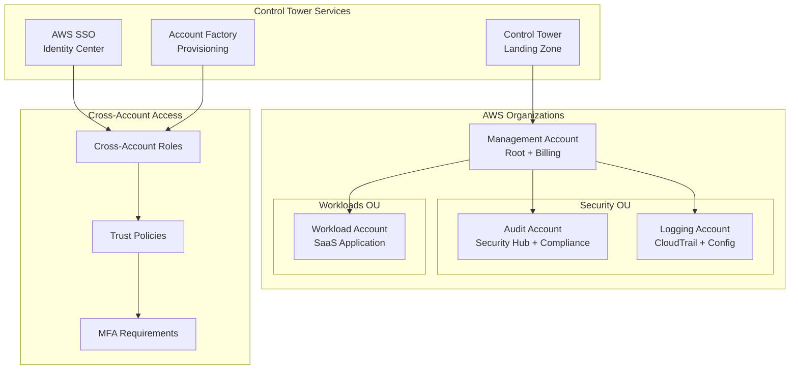
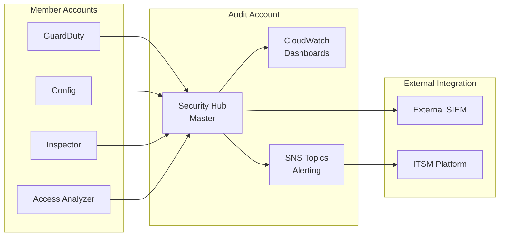

# Design Document: Multi-Account Foundation

## Overview

This design document outlines the comprehensive multi-account security foundation for a multi-tenant SaaS platform (ITOM & ITSM) on AWS. The architecture implements AWS Organizations with Control Tower to establish a secure, compliant, and scalable foundation that supports enterprise-grade security controls, centralized governance, and operational excellence.

The foundation consists of four specialized AWS accounts organized under AWS Organizations with Control Tower providing automated governance, security guardrails, and centralized logging. This design enables secure multi-tenant operations while maintaining strict security boundaries, comprehensive audit trails, and compliance with industry frameworks including SOC 2, ISO 27001, and GDPR.

## Architecture

### High-Level Architecture Diagram



### Account Structure and Responsibilities

**Management Account (Root)**
- AWS Organizations management and billing consolidation
- Control Tower deployment and configuration
- Root-level Service Control Policies (SCPs)
- Emergency break-glass access procedures
- Cross-account role management and trust relationships

**Audit Account (Security Operations)**
- Centralized Security Hub for all security findings aggregation
- GuardDuty, Config, Inspector, and Access Analyzer findings correlation
- Compliance monitoring and reporting (CIS, SOC 2, ISO 27001, GDPR, CSA)
- Security incident investigation and forensics capabilities
- Integration with external SIEM and security tools
**Logging Account (Centralized Logging)**
- Organization-wide CloudTrail log aggregation and analysis
- AWS Config configuration snapshots and compliance history
- VPC Flow Logs collection and network traffic analysis
- Log retention policies and lifecycle management
- CloudWatch Logs aggregation and custom metrics
- Integration with log analysis tools and SIEM platforms

**Workload Account (Application Infrastructure)**
- Multi-tenant SaaS application infrastructure (EKS, RDS, API Gateway)
- Application-specific security controls and monitoring
- Tenant isolation and data segregation mechanisms
- Application performance monitoring and logging
- Development, staging, and production environment separation
- Comprehensive resource tagging for security operations and cost allocation

## Components and Interfaces

### AWS Organizations Configuration

**Organizational Unit Structure:**
```
Root Organization
├── Management Account (Root)
├── Security OU
│   ├── Audit Account
│   └── Logging Account
└── Workloads OU
    └── Workload Account
```

**Key Features:**
- All features enabled for advanced policy management
- Consolidated billing across all accounts
- Centralized account lifecycle management
- Service Control Policy inheritance hierarchy
- Cross-account resource sharing via AWS RAM

### Control Tower Landing Zone

**Core Components:**
- **Landing Zone**: Automated multi-account environment setup
- **Guardrails**: Preventive and detective security controls
- **Account Factory**: Standardized account provisioning workflow
- **Dashboard**: Centralized governance and compliance monitoring
- **AWS SSO Integration**: Centralized identity and access management

**Guardrail Categories:**
- **Mandatory Guardrails**: Cannot be disabled, enforce critical security requirements
- **Strongly Recommended**: Best practice controls that should be enabled
- **Elective**: Additional controls based on specific compliance needs

### Service Control Policies (SCPs)

**Policy Hierarchy:**
```
Root SCP (Applied to all accounts)
├── Security OU SCP (Applied to Audit + Logging)
└── Workloads OU SCP (Applied to Workload Account)
```

**Core Policy Controls:**
- Regional restrictions to approved AWS regions only
- Prevention of security service disabling (CloudTrail, Config, GuardDuty)
- Encryption enforcement for all data storage services
- EC2 instance type restrictions to approved families and sizes
- Root user activity restrictions and MFA requirements
- Protection of security-critical IAM roles and policies
- Mandatory resource tagging enforcement preventing untagged resource creation
### Cross-Account IAM Architecture

**Trust Relationship Pattern:**
```json
{
  "Version": "2012-10-17",
  "Statement": [
    {
      "Effect": "Allow",
      "Principal": {
        "AWS": "arn:aws:iam::MANAGEMENT-ACCOUNT:root"
      },
      "Action": "sts:AssumeRole",
      "Condition": {
        "Bool": {
          "aws:MultiFactorAuthPresent": "true"
        },
        "NumericLessThan": {
          "aws:MultiFactorAuthAge": "3600"
        }
      }
    }
  ]
}
```

**Cross-Account Role Types:**
- **OrganizationAccountAccessRole**: Administrative access for account management
- **SecurityAuditRole**: Read-only access for security auditing and compliance
- **LoggingRole**: Write access for centralized logging services
- **IncidentResponseRole**: Emergency access with enhanced logging
- **ComplianceRole**: Access for compliance monitoring and reporting

### Centralized Security Findings Architecture

**Security Hub Integration Pattern:**


**Finding Aggregation Components:**
- **Security Hub Master**: Centralized findings aggregation in Audit Account
- **Cross-Account Invitations**: Automated member account enrollment
- **Custom Insights**: Automated finding correlation and prioritization
- **Integration APIs**: Connections to external security tools and SIEM
- **Automated Response**: EventBridge rules for finding-based automation

### Comprehensive Tagging Strategy Architecture

**Tagging Governance Framework:**

```mermaid
graph TB
    subgraph "Tag Governance"
        TS[Tagging Strategy<br/>Policy Definition]
        TG[Tag Governance<br/>Rules & Validation]
        TE[Tag Enforcement<br/>SCP Controls]
    end
    
    subgraph "Mandatory Tags"
        ENV[Environment<br/>dev/staging/prod]
        OWN[Owner<br/>Team/Individual]
        PRJ[Project<br/>Project Code]
        CC[CostCenter<br/>Billing Code]
        SC[SecurityClassification<br/>public/internal/confidential]
    end
    
    subgraph "Security Tags"
        DC[DataClassification<br/>pii/phi/financial]
        CF[ComplianceFramework<br/>soc2/iso27001/gdpr]
        BR[BackupRequired<br/>true/false]
        IR[IncidentResponse<br/>critical/high/medium]
    end
    
    subgraph "Automation"
        SCP[SCP Enforcement<br/>Prevent Untagged]
        TI[Tag Inheritance<br/>Parent to Child]
        TR[Tag Remediation<br/>Auto-correction]
        TA[Tag Analytics<br/>Compliance Monitoring]
    end
    
    TS --> ENV
    TS --> OWN
    TS --> PRJ
    TS --> CC
    TS --> SC
    TS --> DC
    TS --> CF
    TS --> BR
    TS --> IR
    TG --> SCP
    TG --> TI
    TG --> TR
    TG --> TA
    TE --> SCP
```


**Tag Categories and Standards:**

**Mandatory Tags (Required on all resources):**
- `Environment`: dev | staging | prod | sandbox
- `Owner`: team-name or individual-email
- `Project`: project-code or application-name
- `CostCenter`: billing-code for cost allocation
- `SecurityClassification`: public | internal | confidential | restricted

**Security-Specific Tags:**
- `DataClassification`: none | pii | phi | financial | intellectual-property
- `ComplianceFramework`: soc2 | iso27001 | gdpr | pci-dss | hipaa
- `BackupRequired`: true | false
- `IncidentResponse`: critical | high | medium | low
- `DataRetention`: 30d | 90d | 1y | 3y | 7y | permanent
- `EncryptionRequired`: true | false

**Operational Tags:**
- `MaintenanceWindow`: weekday-night | weekend | 24x7-available
- `AutoShutdown`: true | false (for cost optimization)
- `MonitoringLevel`: basic | enhanced | custom
- `PatchGroup`: immediate | standard | delayed

**Tag Enforcement Mechanisms:**
- **Service Control Policies**: Prevent resource creation without mandatory tags
- **AWS Config Rules**: Monitor tag compliance and trigger remediation
- **Lambda Functions**: Automated tag application and correction
- **EventBridge Rules**: Real-time tag validation and notification
- **Cost Allocation Tags**: Enable detailed cost tracking and analysis

## Data Models

### Account Configuration Model
```yaml
Account:
  accountId: string
  accountName: string
  accountType: enum [Management, Audit, Logging, Workload]
  organizationalUnit: string
  serviceControlPolicies: list[PolicyArn]
  crossAccountRoles: list[RoleConfiguration]
  securityBaseline: SecurityBaselineConfig
  complianceFrameworks: list[ComplianceFramework]
```
### Service Control Policy Model
```yaml
ServiceControlPolicy:
  policyId: string
  policyName: string
  policyDocument: json
  targetType: enum [Root, OrganizationalUnit, Account]
  targets: list[string]
  effectivePermissions: list[Permission]
  complianceControls: list[ComplianceControl]
```

### Security Finding Model
```yaml
SecurityFinding:
  findingId: string
  sourceAccount: string
  sourceService: enum [GuardDuty, Config, Inspector, AccessAnalyzer]
  severity: enum [Critical, High, Medium, Low, Informational]
  findingType: string
  resource: ResourceIdentifier
  createdAt: timestamp
  updatedAt: timestamp
  status: enum [New, Assigned, InProgress, Resolved, Suppressed]
  compliance: list[ComplianceFramework]
```

### Cross-Account Role Model
```yaml
CrossAccountRole:
  roleArn: string
  roleName: string
  trustPolicy: json
  permissionsPolicies: list[PolicyArn]
  mfaRequired: boolean
  sessionDuration: integer
  externalId: string (optional)
  conditions: list[IAMCondition]
```

### Tagging Strategy Model
```yaml
TaggingStrategy:
  mandatoryTags:
    environment: enum [dev, staging, prod, sandbox]
    owner: string (team-name or email)
    project: string (project-code)
    costCenter: string (billing-code)
    securityClassification: enum [public, internal, confidential, restricted]
  
  securityTags:
    dataClassification: enum [none, pii, phi, financial, intellectual-property]
    complianceFramework: list[enum [soc2, iso27001, gdpr, pci-dss, hipaa]]
    backupRequired: boolean
    incidentResponse: enum [critical, high, medium, low]
    dataRetention: enum [30d, 90d, 1y, 3y, 7y, permanent]
    encryptionRequired: boolean
  
  operationalTags:
    maintenanceWindow: enum [weekday-night, weekend, 24x7-available]
    autoShutdown: boolean
    monitoringLevel: enum [basic, enhanced, custom]
    patchGroup: enum [immediate, standard, delayed]
  
  enforcement:
    scpEnforcement: boolean
    configRules: list[ConfigRuleName]
    automatedRemediation: boolean
    complianceMonitoring: boolean
```

### Resource Tag Compliance Model
```yaml
ResourceTagCompliance:
  resourceArn: string
  resourceType: string
  accountId: string
  region: string
  currentTags: map[string, string]
  requiredTags: list[TagRequirement]
  complianceStatus: enum [compliant, non-compliant, exempt]
  lastChecked: timestamp
  remediationActions: list[RemediationAction]
```

Now let me analyze the acceptance criteria for testability using the prework tool:

<function_calls>
<invoke name="prework">
<parameter name="featureName">multi-account-foundation
## Correctness Properties

*A property is a characteristic or behavior that should hold true across all valid executions of a system-essentially, a formal statement about what the system should do. Properties serve as the bridge between human-readable specifications and machine-verifiable correctness guarantees.*

### Property Reflection

After analyzing all acceptance criteria, I identified several areas where properties can be consolidated to eliminate redundancy and provide more comprehensive validation:

**Consolidation Areas:**
- **Cross-account role properties (3.1-3.4)** → Combined into Property 1: Cross-Account Role Security Enforcement
- **Security baseline properties (4.1-4.6)** → Combined into Property 2: Security Baseline Consistency  
- **Service Control Policy properties (5.1-5.7)** → Combined into Property 3: Service Control Policy Enforcement
- **Logging aggregation properties (6.1-6.2, 10.1-10.4)** → Combined into Properties 4 & 5: Centralized Security Findings Aggregation & Log Aggregation Completeness
- **Account Factory properties (7.1-7.5)** → Combined into Property 6: Account Factory Security Baseline Application
- **Multi-region properties (8.1-8.2)** → Combined into Property 7: Multi-Region Security Control Consistency
- **Emergency access properties (11.3-11.4)** → Combined into Property 8: Emergency Access Session Management
- **Compliance properties (9.5)** → Standalone as Property 9: Compliance Audit Trail Completeness
- **Tagging properties (11.1-11.8)** → Combined into Properties 10-12: Comprehensive Tagging Compliance, Tag-Based Access Control, Automated Tag Remediation

**Total: 12 comprehensive properties consolidating 50+ acceptance criteria**

### Core Correctness Properties

**Property 1: Cross-Account Role Security Enforcement**
*For any* cross-account role in the organization, the role must require MFA authentication, implement time-limited sessions, and log all assumption activities to CloudTrail
**Validates: Requirements 3.1, 3.2, 3.3, 3.4**

**Property 2: Security Baseline Consistency**
*For any* account in the organization, the account must have CloudTrail enabled with log file validation, Config enabled for resource tracking, and default encryption enabled for all supported services
**Validates: Requirements 4.2, 4.3, 4.4**

**Property 3: Service Control Policy Enforcement**
*For any* account in the organization, attempts to delete CloudTrail, disable security services, create resources in non-approved regions, or launch non-approved EC2 instance types must be denied by Service Control Policies
**Validates: Requirements 5.1, 5.2, 5.3, 5.7**

**Property 4: Centralized Security Findings Aggregation**
*For any* security finding generated in member accounts (GuardDuty, Config, Inspector, Access Analyzer), the finding must be aggregated and visible in the Audit Account's Security Hub within the defined time window
**Validates: Requirements 10.1, 10.2, 10.3, 10.4**

**Property 5: Log Aggregation Completeness**
*For any* CloudTrail or Config event generated in member accounts, the log entry must be delivered to and accessible from the centralized Logging Account within the defined retention period
**Validates: Requirements 6.1, 6.2**

**Property 6: Account Factory Security Baseline Application**
*For any* account provisioned through Account Factory, the account must automatically receive the appropriate security baseline configuration, Service Control Policies, and cross-account roles based on its account type
**Validates: Requirements 7.1, 7.2, 7.3**

**Property 7: Multi-Region Security Control Consistency**
*For any* security control deployed in the primary region, an equivalent control with the same configuration must exist and be operational in all secondary regions
**Validates: Requirements 8.1, 8.2**

**Property 8: Emergency Access Session Management**
*For any* emergency break-glass access session, the session must automatically expire after the defined time period and generate enhanced logging throughout its duration
**Validates: Requirements 11.3, 11.4**

**Property 9: Compliance Audit Trail Completeness**
*For any* administrative or security activity performed across the organization, a complete audit trail must be maintained and accessible for compliance reporting and evidence collection
**Validates: Requirements 9.5**

**Property 10: Comprehensive Tagging Compliance**
*For any* AWS resource created in the organization, the resource must have all mandatory tags (Environment, Owner, Project, CostCenter, SecurityClassification) and appropriate security-specific tags based on its classification and compliance requirements
**Validates: Requirements 11.1, 11.2, 11.3**

**Property 11: Tag-Based Access Control Enforcement**
*For any* resource access attempt, the access control decision must consider the resource's security classification tags and the user's authorized access levels
**Validates: Requirements 11.5**

**Property 12: Automated Tag Remediation**
*For any* resource found to be non-compliant with tagging requirements, automated remediation must be triggered within the defined time window with appropriate notifications
**Validates: Requirements 11.8**

## Error Handling

### Account Provisioning Failures
- **Rollback Strategy**: Automatic rollback of partially created accounts with cleanup of associated resources
- **Notification System**: Real-time alerts to administrators for provisioning failures
- **Retry Logic**: Automated retry with exponential backoff for transient failures
- **Manual Intervention**: Escalation procedures for persistent failures requiring human intervention

### Cross-Account Access Failures
- **Authentication Failures**: Clear error messages for MFA and credential issues
- **Authorization Failures**: Detailed logging of permission denials for troubleshooting
- **Session Expiration**: Graceful handling of expired sessions with re-authentication prompts
- **Emergency Access**: Break-glass procedures for critical access needs during failures

### Service Control Policy Violations
- **Denial Logging**: Comprehensive logging of all SCP denials with context
- **User Notification**: Clear error messages explaining policy violations
- **Exception Handling**: Documented procedures for legitimate exceptions
- **Policy Testing**: Validation mechanisms to test SCP changes before deployment

### Security Finding Aggregation Failures
- **Retry Mechanisms**: Automatic retry for failed finding deliveries
- **Dead Letter Queues**: Capture and analysis of persistently failed findings
- **Monitoring Alerts**: Real-time alerts for aggregation service failures
- **Manual Recovery**: Procedures for recovering missed findings during outages

### Tagging Compliance Failures
- **SCP Enforcement**: Clear error messages when resource creation is blocked due to missing tags
- **Remediation Workflows**: Automated tag application for non-compliant resources
- **Compliance Monitoring**: Real-time alerts for tag compliance violations
- **Exception Handling**: Documented procedures for legitimate tagging exceptions
- **Bulk Remediation**: Tools for correcting large numbers of non-compliant resources

## Testing Strategy

### Testing Implementation Approach

**Important Note**: All testing is performed in **dedicated testing environments** and **never impacts production AWS accounts**. Testing uses a combination of AWS Config Rules, Lambda functions, and infrastructure validation scripts.

#### Unit Testing Examples

**Unit Test Example 1: Organizations Structure Validation**
```python
def test_organization_structure():
    """Test that the organization has the expected account structure"""
    # This runs against test environment, not production
    org_client = boto3.client('organizations')
    
    # Verify organization exists and has all features enabled
    org = org_client.describe_organization()
    assert org['Organization']['FeatureSet'] == 'ALL'
    
    # Verify expected accounts exist
    accounts = org_client.list_accounts()
    account_names = [acc['Name'] for acc in accounts['Accounts']]
    
    expected_accounts = ['Management', 'Audit', 'Logging', 'Workload']
    for expected in expected_accounts:
        assert any(expected in name for name in account_names)
```

**Unit Test Example 2: Service Control Policy Attachment**
```python
def test_scp_attachment():
    """Test that SCPs are properly attached to OUs"""
    org_client = boto3.client('organizations')
    
    # Get Security OU
    security_ou = get_ou_by_name('Security')
    
    # Verify SCP is attached
    policies = org_client.list_policies_for_target(
        TargetId=security_ou['Id'],
        Filter='SERVICE_CONTROL_POLICY'
    )
    
    policy_names = [p['Name'] for p in policies['Policies']]
    assert 'SecurityOUPolicy' in policy_names
```

#### Property-Based Testing Examples

**Property Test Example 1: Cross-Account Role MFA Enforcement**
```python
@given(account_id=valid_account_ids(), role_name=valid_role_names())
def test_cross_account_role_mfa_required(account_id, role_name):
    """Property: All cross-account roles must require MFA"""
    # Generate random valid account IDs and role names
    # Test against test environment with representative data
    
    iam_client = boto3.client('iam')
    
    try:
        role = iam_client.get_role(RoleName=role_name)
        trust_policy = role['Role']['AssumeRolePolicyDocument']
        
        # Property: MFA must be required in trust policy
        conditions = trust_policy.get('Statement', [{}])[0].get('Condition', {})
        assert 'aws:MultiFactorAuthPresent' in conditions.get('Bool', {})
        assert conditions['Bool']['aws:MultiFactorAuthPresent'] == 'true'
        
    except ClientError as e:
        if e.response['Error']['Code'] != 'NoSuchEntity':
            raise
```

**Property Test Example 2: Resource Tagging Compliance**
```python
@given(resource_arn=valid_resource_arns())
def test_mandatory_tags_present(resource_arn):
    """Property: All resources must have mandatory tags"""
    # Generate random resource ARNs from test environment
    
    resource_client = get_resource_client(resource_arn)
    
    try:
        tags = get_resource_tags(resource_arn)
        tag_keys = [tag['Key'] for tag in tags]
        
        # Property: All mandatory tags must be present
        mandatory_tags = ['Environment', 'Owner', 'Project', 'CostCenter', 'SecurityClassification']
        for required_tag in mandatory_tags:
            assert required_tag in tag_keys, f"Missing mandatory tag: {required_tag}"
            
        # Property: SecurityClassification must have valid value
        security_class = next(tag['Value'] for tag in tags if tag['Key'] == 'SecurityClassification')
        valid_classifications = ['public', 'internal', 'confidential', 'restricted']
        assert security_class in valid_classifications
        
    except Exception as e:
        # Log for analysis but don't fail on non-existent test resources
        logger.info(f"Resource {resource_arn} not found in test environment: {e}")
```

#### Testing Environment Setup

**Test Environment Requirements:**
- **Dedicated AWS Organization**: Separate from production, mirrors production structure
- **Test Data Generation**: Scripts to create representative test resources
- **AWS Config Rules**: Custom rules for continuous compliance monitoring
- **Lambda Functions**: Automated testing execution and reporting
- **No Production Impact**: All testing isolated to dedicated test accounts

**Testing Tools and Frameworks:**
- **Hypothesis**: Python property-based testing framework
- **Boto3**: AWS SDK for Python for API interactions
- **AWS Config**: For continuous compliance monitoring
- **AWS Lambda**: For automated test execution
- **CloudFormation**: For test environment provisioning
- **pytest**: Unit testing framework

**Test Execution Flow:**
1. **Setup**: Provision test environment with CloudFormation
2. **Data Generation**: Create test resources with various configurations
3. **Unit Tests**: Validate specific configurations and edge cases
4. **Property Tests**: Run 100+ iterations with random valid inputs
5. **Cleanup**: Remove test resources and environments
6. **Reporting**: Generate compliance and test coverage reports

This approach ensures comprehensive testing without any risk to production environments while validating that our security controls work correctly across all possible configurations.

### Property-Based Testing Configuration
- **Testing Framework**: AWS Config Rules and custom Lambda functions for property validation
- **Test Iterations**: Minimum 100 iterations per property test due to randomization
- **Test Environment**: Dedicated testing organization with representative account structure
- **Validation Frequency**: Continuous monitoring with daily comprehensive validation

### Test Categories

**Configuration Validation Tests**
- Verify AWS Organizations structure and account placement
- Validate Control Tower guardrail deployment and status
- Confirm Service Control Policy attachment and inheritance
- Test cross-account role trust relationships and permissions

**Security Control Tests**
- Test Service Control Policy enforcement across different scenarios
- Validate security baseline application on new accounts
- Verify centralized logging and finding aggregation
- Test emergency access procedures and automatic expiration

**Compliance Tests**
- Validate SOC 2, ISO 27001, and GDPR control implementation
- Test audit trail completeness and integrity
- Verify compliance reporting and evidence collection
- Test data residency and cross-border transfer controls

**Integration Tests**
- Test Account Factory provisioning workflows
- Validate external SIEM and security tool integration
- Test multi-region security control replication
- Verify incident response coordination capabilities
- Test comprehensive tagging strategy enforcement and remediation

**Tagging Strategy Tests**
- Validate mandatory tag enforcement through Service Control Policies
- Test automated tag inheritance from parent to child resources
- Verify tag-based access control enforcement
- Test automated tag remediation workflows and notifications
- Validate cost allocation and security operations filtering based on tags

Each property test must be tagged with: **Feature: multi-account-foundation, Property {number}: {property_text}**